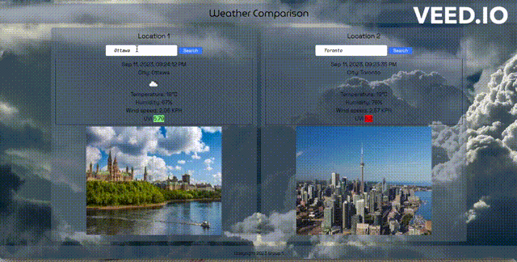

# Weather Comparison application

  
## Description:

Weather Comparison is a web application that allows any user to find the current weather of two cities in the world and compare it, in addition to that, the user will be able to see a representative picture of each city.

 
## Table of Contents:

- [Overview](#Overview)
- [The Challenge](#The-Challenge)
- [User Story](#User-Story)
- [Acceptance Criteria](#Acceptance-Criteria)
- [GIF](#GIF)
- [Usage Instructions](#Usage-Instructions)
- [Technologies Used](#Technologies-Used)
- [Solution URL](#Solution-URL)
- [Screenshots](#Screenshots)
- [Credits](#Credits)
- [License](#License)


# Overview

## The Challenge:
- Use a CSS framework other than Bootstrap.
- Be deployed to GitHub Pages.
- Be interactive (i.e: accept and respond to user input).
- Use at least two server-side APIs.
- Does not use alerts, confirms, or prompts (use modals).
- Use client-side storage to store persistent data.
- Be responsive.
- Have a polished UI.
- Have a clean repository that meets quality coding standards (file         structure, naming conventions, follows best practices for class/id-naming conventions, indentation, quality comments, etc.).
- Have a quality README (with unique name, description, technologies used, screenshot, and link to deployed application). 


## User Story

```md
AS AN user of the Weather Comparison application, 
I WANT to compare the weather of any two cities in world, and see a representative picture of each city,
SO THAT I can be able to know the climatic differences of the two cities and have a clear idea about the each city.

```

## Acceptance Criteria

```md
GIVEN I am using Weather Comparison application to compare the weatther of two cities,
WHEN I open the application,
THEN I can see two containers with a search input field,
WHEN I write the name of a city in the first container's input field, 
THEN I am presented with the weather and a representative picture of that city,
WHEN I write the name of a different city in the second container's input field,
THEN I am presented with the weather and a representative picture of that city.

```

## GIF
### Figure .1 GIF

The following animation demonstrates the application functionality:



## Usage Instructions

1. Open Weather Comparison application on your local device.
2. Write down the name of a city in the first container's input field.
3. Click on the search button.
4. Write down the name of a second city in the second container's input field.
5. Compare the data and enjoy the photo.


## Technologies Used

- Tailwinds
- Google API
- Proxies


## Solution URL
[Weather Comparison URL](https://azukicoconut.github.io/ProjectBagEnd)


## Screenshots

### Figure 1. Screenshot
 


## Credits

Project Coordinator: 
Matthew Tingley

HTML:
Fernando Ibarra Fernandez de Castro

CSS:
Greg Rankin

JavaScript:
Hui Pan & Matthew Tingley


## License & Copyright ©
  
[](https://opensource.org/licenses/MIT) [Open Source Initiative Link](https://opensource.org/licenses/MIT)
